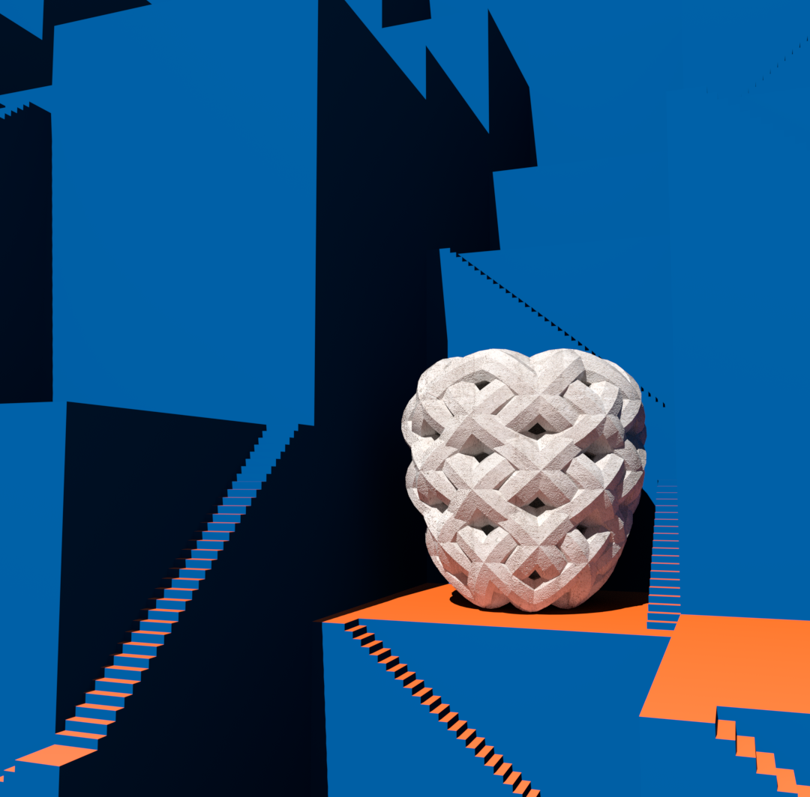
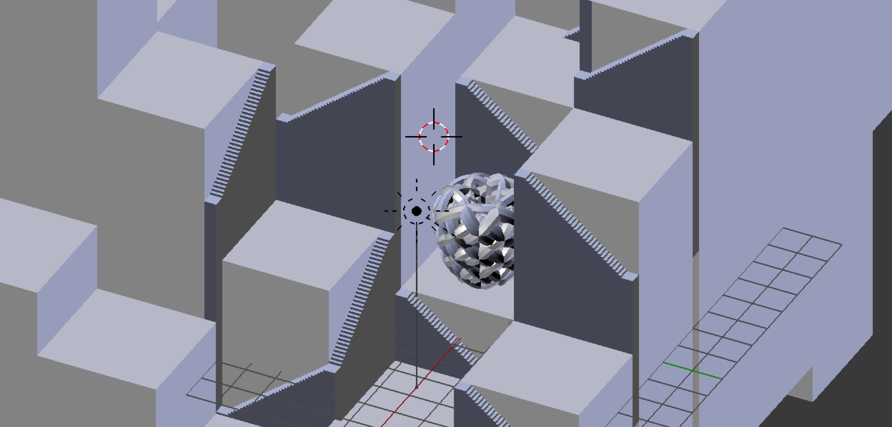
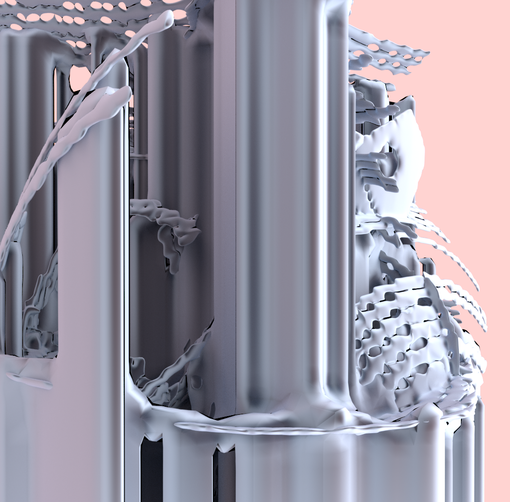
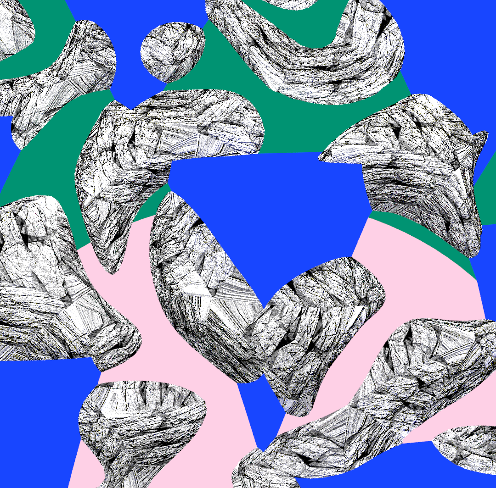
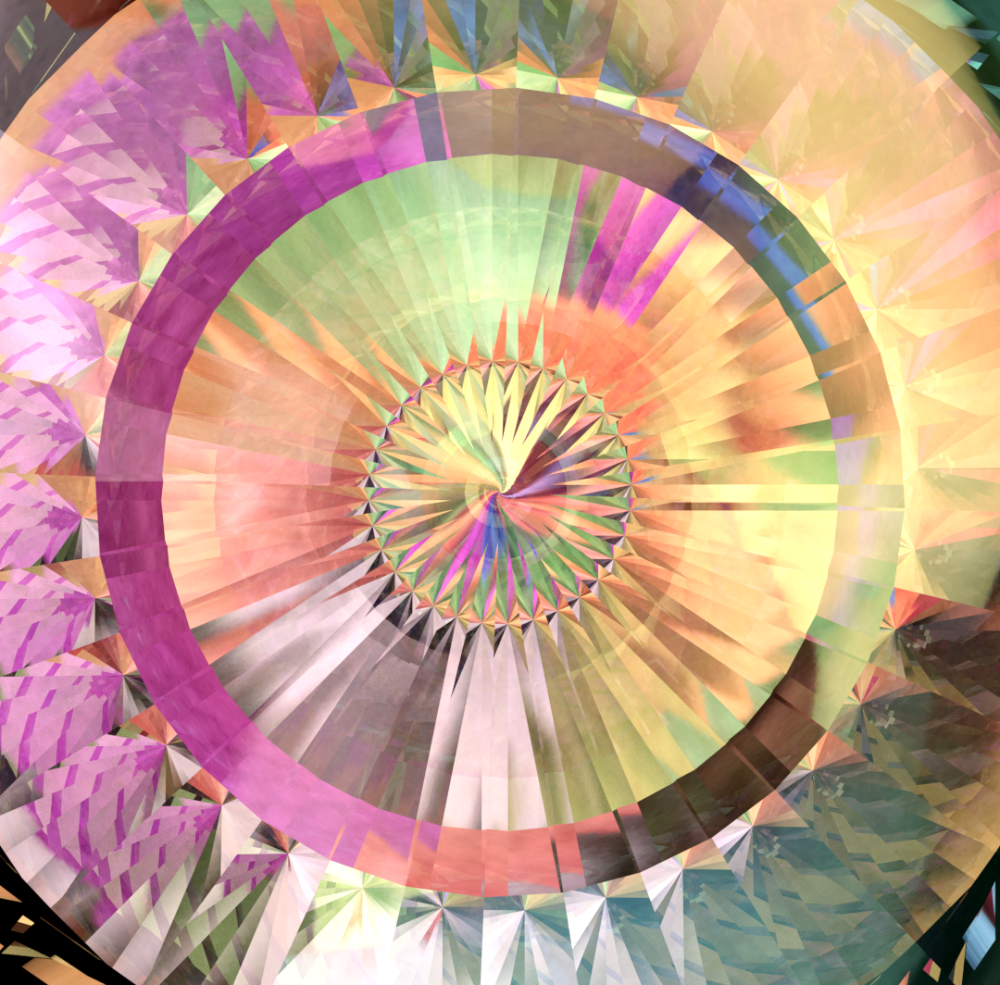
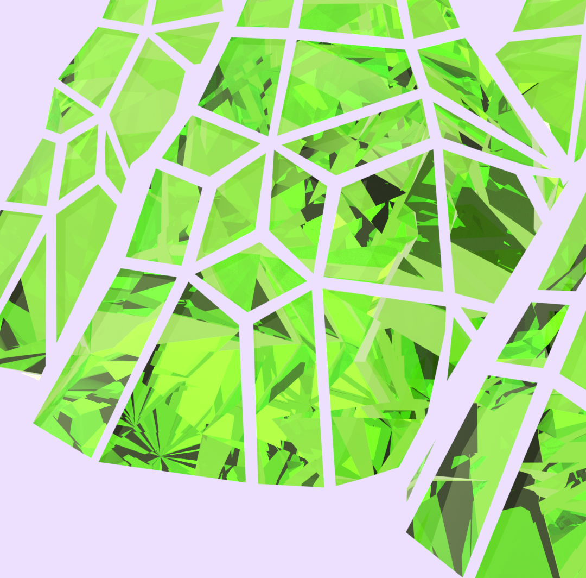

{::options parse_block_html="true" /}

**3D illustrations**

made in **Blender**, experimenting with shaders, lighting and physics.

[instagram.com/vividfax/](https://www.instagram.com/vividfax/)

I can't remember exactly why I got into 3D but for a while I was doing daily sketches, and these are a few of them. One of my main focuses at this time was trying to inject more colour into my work to try and get better at colour theory through practice.

