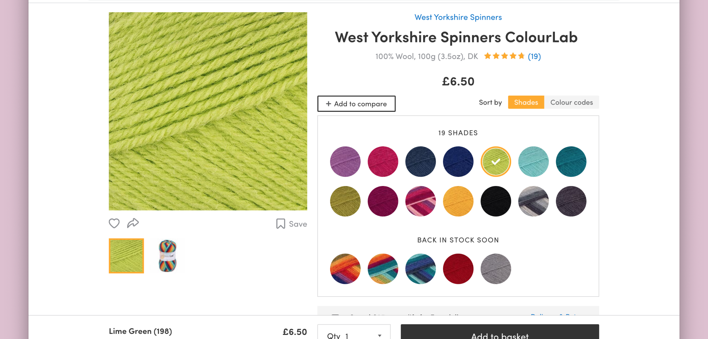

{::options parse_block_html="true" /}

**Colourway**

is a **tool** that finds the closest matching yarns for a specific colour from a colour picker.

[vividfax.github.io/colourway/](https://vividfax.github.io/colourway/)

Whenever I knit something for a friend my first question for them is always what colour they'd like. Sometimes the answer is vauge and sometimes they’re highly specific. This tool aids you in your quest to find that specific shade of ‘bricky orange’.

 

**Web development**

Built in **p5.js**, using **Bootstrap**’s responsive grid system.

