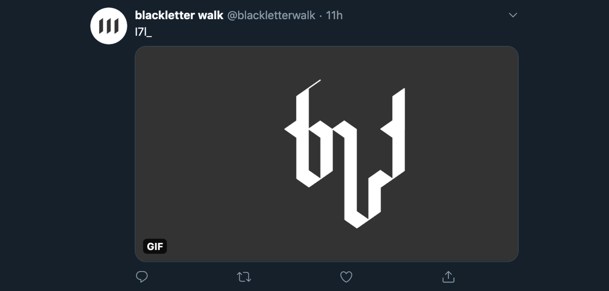

{::options parse_block_html="true" /}

**Blackletter Walk**

is an automatic writing gif **bot** that borrows its visual language from blackletter calligraphy.

[twitter.com/blackletterwalk](https://twitter.com/blackletterwalk)

 

**Generative art** 

The animation is drawn with **Node.js**’s node-canvas and gifencoder, and the last frame is then run through Ocrad.js to provide an **OCR** (optical character recognition) text preview that accompanies the tweet.

 

**Web development**

The bot lives on **Heroku**, tweeting automatically through the **Twitter API** via Twit.

