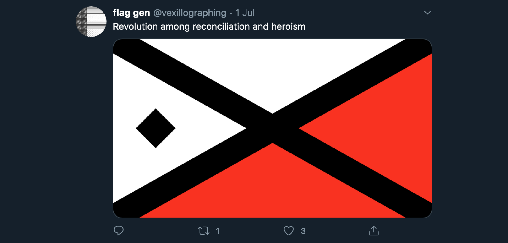

{::options parse_block_html="true" /}

**Flag Gen**

is a Twitter **bot** that generates random flag designs and mottos based on the design principles of vexillography and heraldry.

[twitter.com/vexillographing](https://twitter.com/vexillographing)

 

**Generative art** 

Built in **JavaScript**, using **Node.js**’s node-canvas to plot vector points.

 

**Web development**

It runs on **Heroku** using Twit to access **Twitter’s API**.

