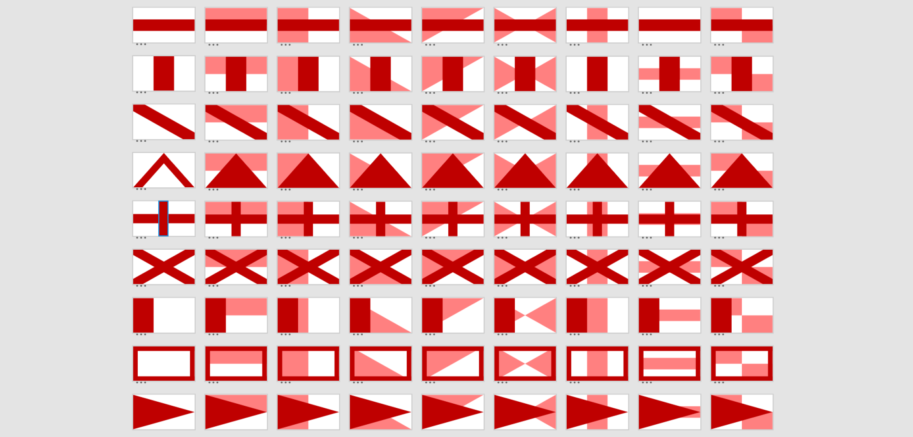

{::options parse_block_html="true" /}

**Flag Gen**

is a **twitter bot** that **generates random flag designs** and mottos based on the design principles of vexillography and heraldry.

[twitter.com/vexillographing](https://twitter.com/vexillographing)

After listening to [99% Invisible's episode on vexillology](https://99percentinvisible.org/episode/vexillonaire/) I became interested in the way flags are constructed from layers consisting of the division, the ordinary and the charge. These three components can be combined in near endless configurations to create recognisable flags that are used today. I decided to exhaust these combinations by building a bot. The most interesting part of this project for me is the meaning derived from the mottos that accompany the flags. I compiled a set of words associated with specific colours, and for each colour that appears on the flag, a word is added to the motto.

[vividfax.github.io/generative-flag-design](https://vividfax.github.io/generative-flag-design)

In the process of making a random flag generator twitter bot, I did a lot of research into heraldry and vexillology. I learned a great deal about layering shapes and working with colour. I've **written up a document on how I created the bot**, from designing to programming. In it, I shared the heraldic and vexillological research that I found most useful, and then I expanded more on shape, layering, fimbriation, alignment, colour, mottos, p5.js and twitter bots. Lastly, I answered miscellaneous questions on how I designed and built the generator.

 

**Generative art** 

Built in **JavaScript**, using **Node.js**’s node-canvas to plot vector points.

 

**Web development**

It runs on **Heroku** using Twit to access **Twitter’s API**.

