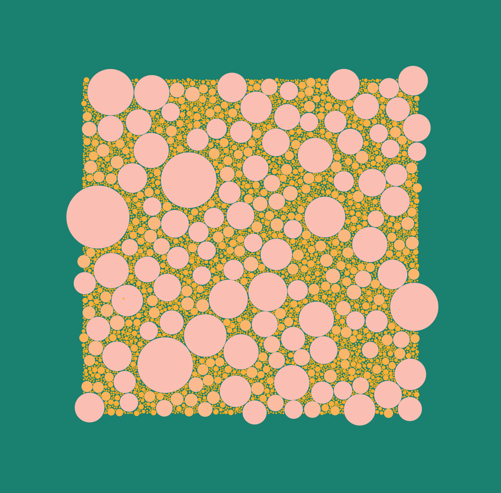
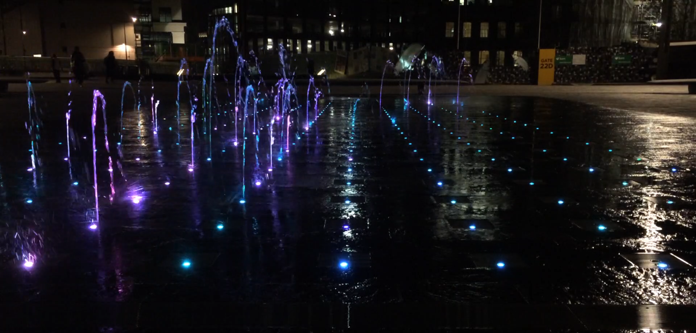

{::options parse_block_html="true" /}

**Generative sketches**

drawn in **p5.js**, that use randomness.

[instagram.com/vividfax/](https://www.instagram.com/vividfax/)

 

**Installation art** 

I coded a 3D version of John Conway’s **Game of Life** for the Granary Square fountains at Kings Cross. The age of the cell controls the height of the fountain jet and the growth from the initial state controls the LEDs.

