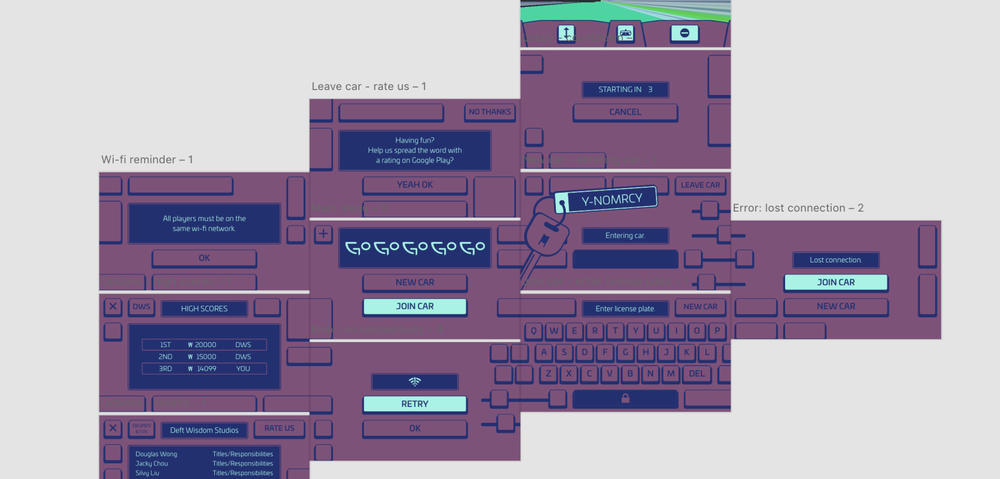
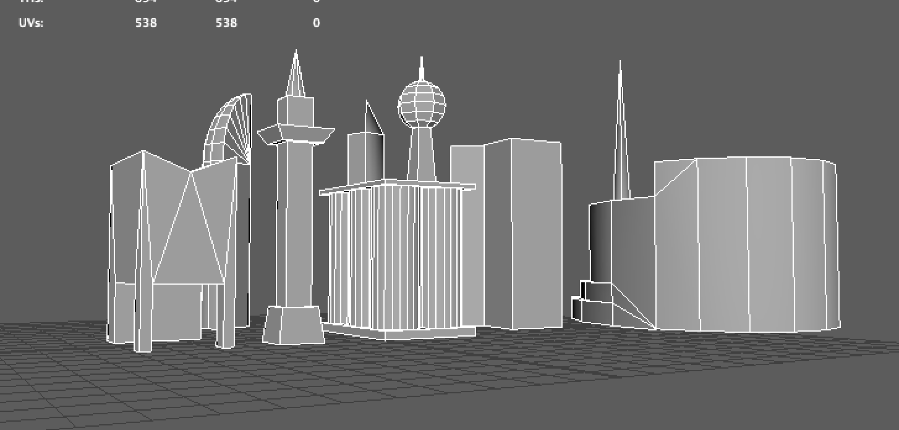

{::options parse_block_html="true" /}

# GOGOGOGOGOGO

is a co-op first-person driving **game** set in a retrofuturistic version of Busan.

I'm big into indie games and when a friend invited me onto a project I enthusiastically volunteered myself for anything that I could help out with.

 

**UI design** 

Working remotely with a geographically diverse eight-person team, I designed the UI in **Adobe XD** and built it in **Unity**, and drew vector art in **Illustrator**.

 

**3D modelling**

I made some low-poly skyscrapers and landmarks in **Maya**.

