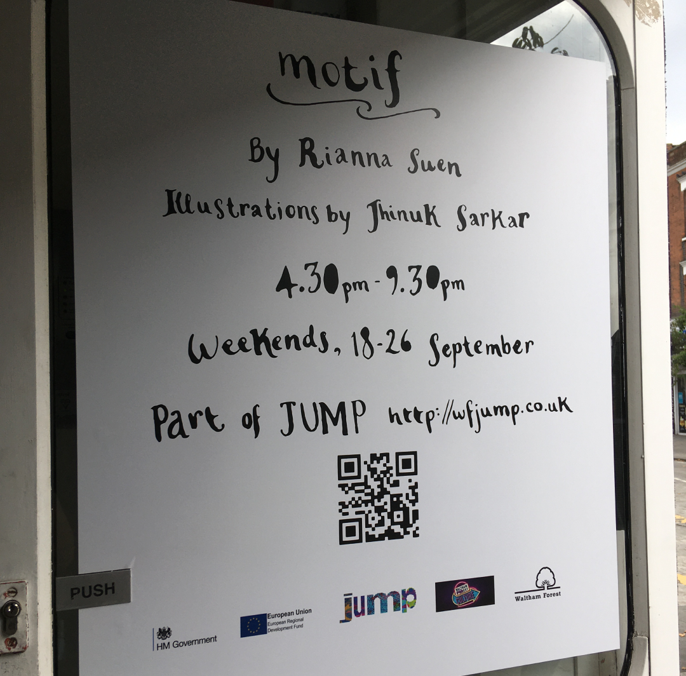
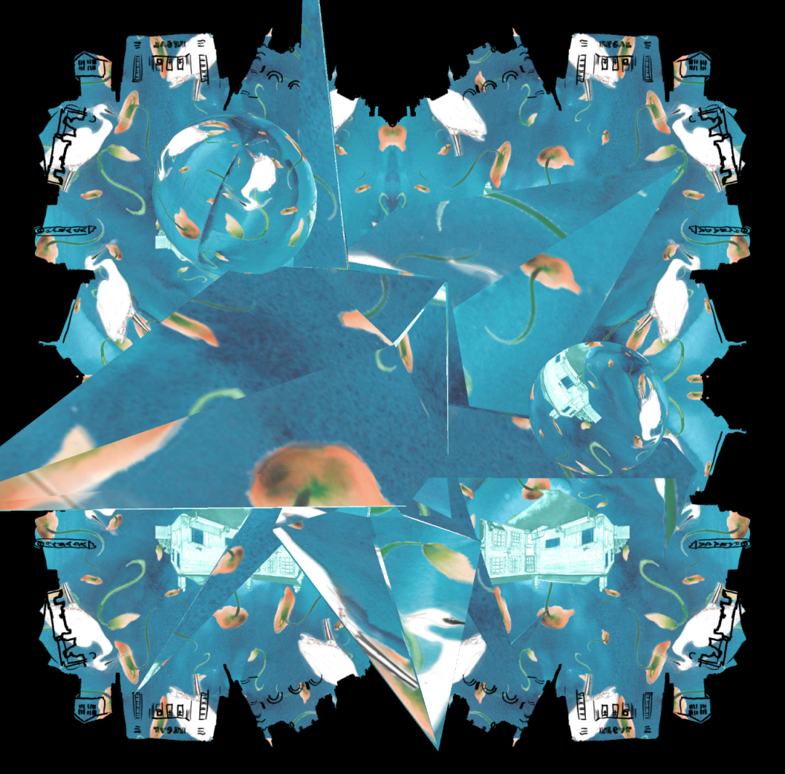
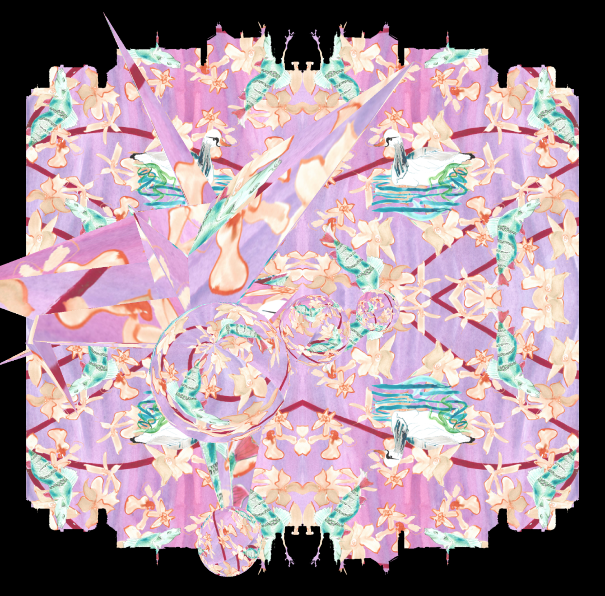
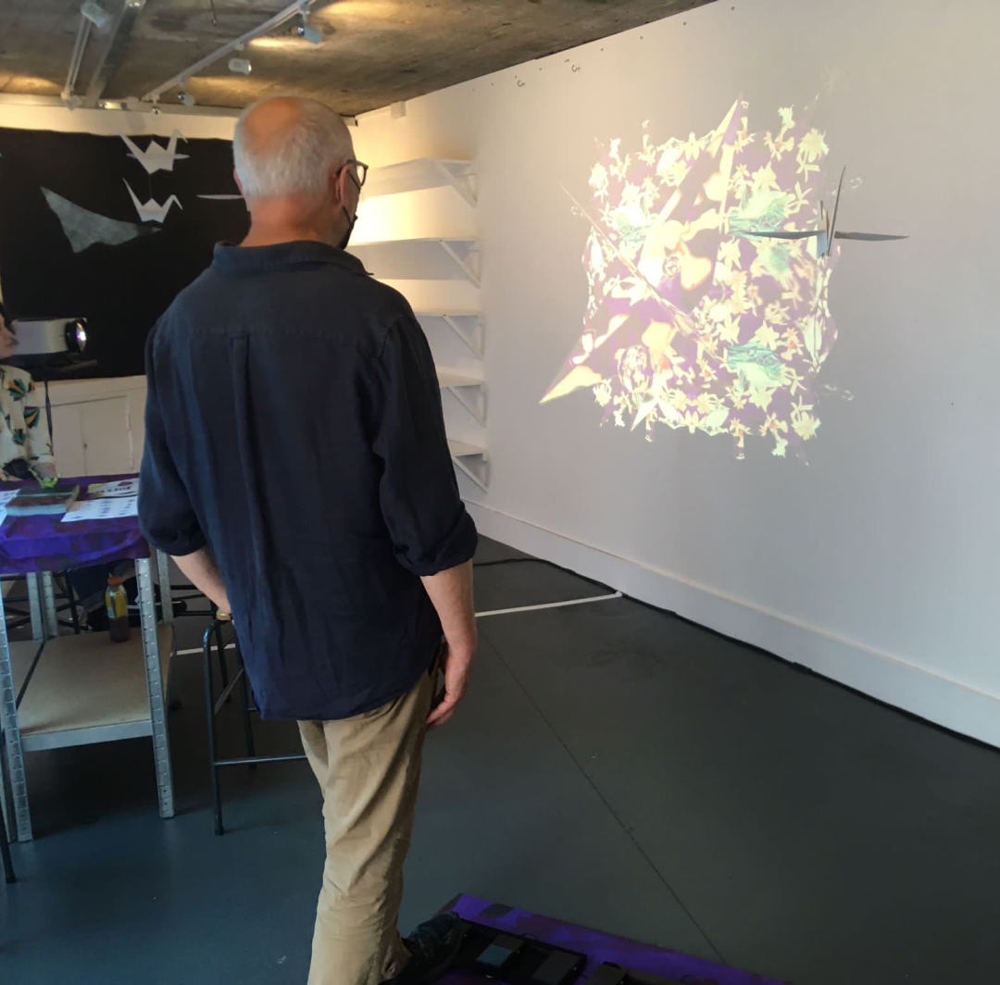

{::options parse_block_html="true" /}

**Motif**

is a **projected pattern making game**, commissioned by Waltham Forest Council as part of JUMP festival, and featuring illustrations by [Jhinuk Sarkar](https://paperfigillustration.com/). The project is based on William Morris’s technique of layering imagery to create complex patterns, and features landmarks, animals and greenery that can be found in Waltham Forest. The exhibition featured drop-in origami crane making, inspired by the birds that are a common motif in William Morris’s work.

[vividfax.itch.io/motif](https://vividfax.itch.io/motif)

 

**Generative art** 

Built in **p5.js**.

 

**Interactive installation**

The game was projected on a wall in the exhibition space, with foot operated pedals to control each layer of the composition.

