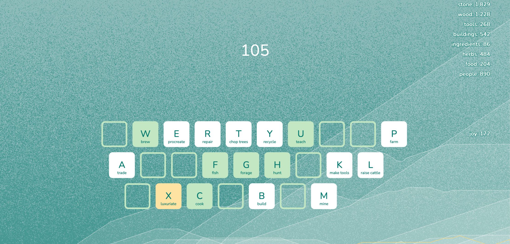
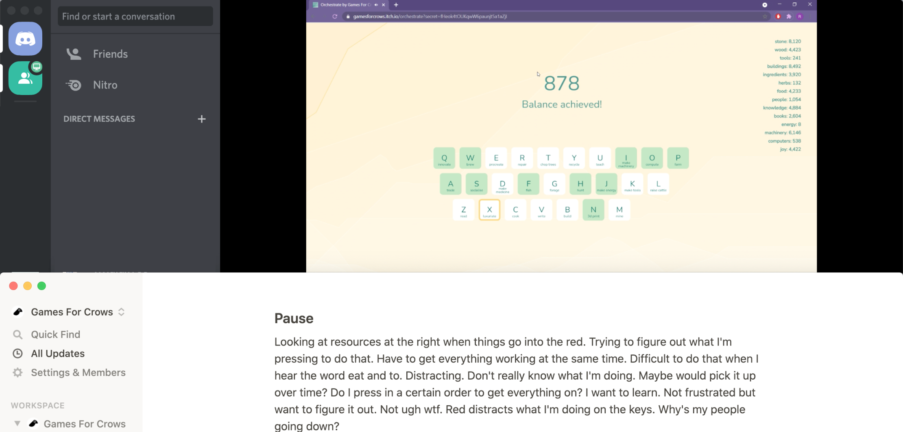

{::options parse_block_html="true" /}

**Orchestrate**

is a sound based resource management **game**.

[gamesforcrows.itch.io/orchestrate/](https://gamesforcrows.itch.io/orchestrate/)

This was a collaborative effort to create an experimental game that combines **data visualisation**, resource management, and a sound playground.

I had been playing around with **live coding** music in **TidalCycles** and ended up creating music that sounded like it belonged in a videogame. This promped the idea to design a game around the music.

 

**Game development**

Built in **p5.js**, using **Tone.js**’s sound library.

 

**Playtesting**

We playtested over Discord with multiple players throughout development, iterating upon their feedback.

