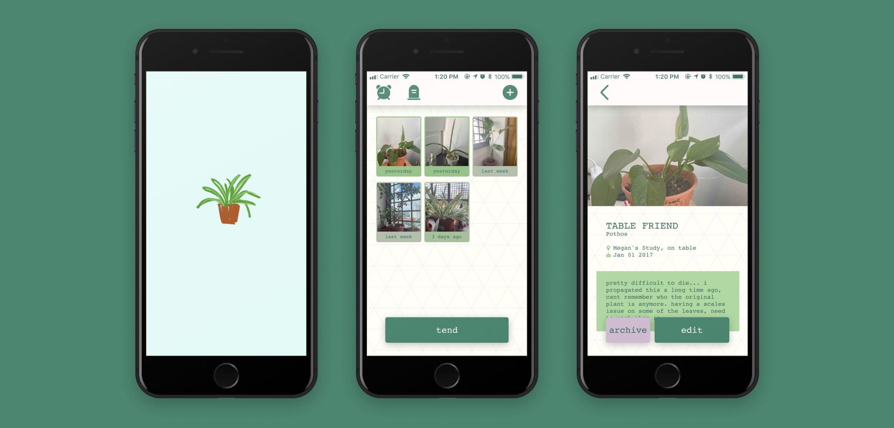
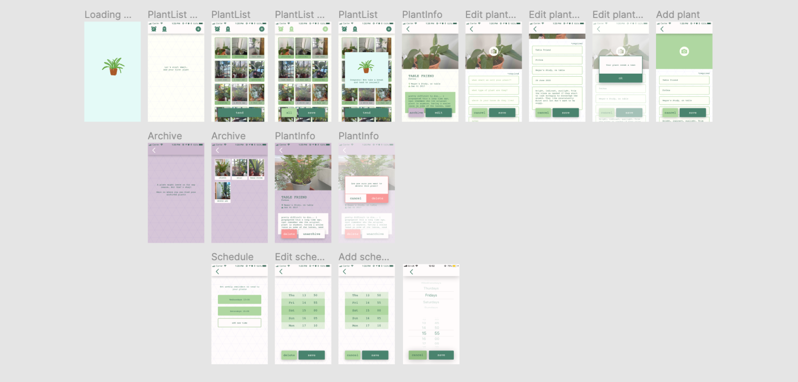

{::options parse_block_html="true" /}

**Planthood**

is a plant care **app** for casual indoor gardeners who haven’t yet learned how to read their plants needs instinctually, or people who just have a lot of house plants.

The project came about when a friend came to me wanting an app to help her look after her 21 plant children. We were specifically interested in creating an app that wouldn't guilt the user into keeping up a daily streak. There was also another aspect we wanted to address: plant death. Plant death is a natural thing that just happens. We focused on creating space in our app for users to keep track of both past and present plants, and the transition inbetween.

 

**Ideation** 

I designed a **moodboard**, defining the features, target user, and the look and feel of the app.

**Interaction design** 

Drew a **content map** that laid out the features of the app. Then put together **interaction maps** detailing every choice and interaction the user could make.

 

**UI design** 

Created a **wireframe** in **Figma** and linked up the pages to create a **clickable prototype**.

**User testing** 

User tested the clickable prototype, using **Lookback** to faciliate and observe.

 

**Front-end iOS development** 

I built the app with **React Native**, using **Expo** to preview the build on my phone.

