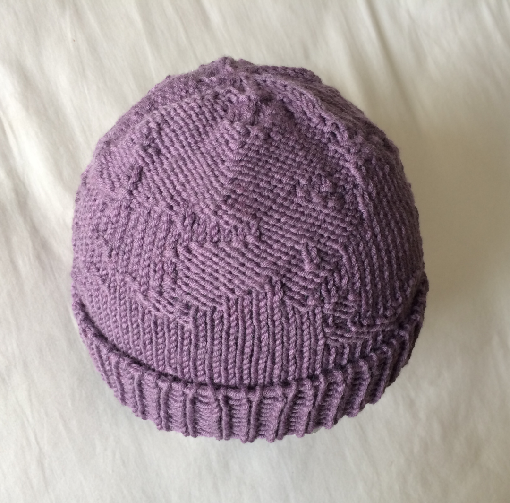

{::options parse_block_html="true" /}

**Terrain Hat**

is a knitted hat that uses **simplex noise** as a stitch pattern.

[vividfax.github.io/terrain-hat/](https://vividfax.github.io/terrain-hat/)

I learn something new with every knitting pattern that I knit from, and when I first learned about knitting from charts I immediately saw it as a space for generative pixel-based art. In knitting there are two sides to a stitch; a knit side on the front and a purl side that's usually on the back. This binary system can be configured in so many different ways. Many basic stitch patterns are just a combination of knits and purls, repeated in a uniform manner. I threw a bit of randomness into the mix and this is the result.

 

**Generative design** 

I built an **interactive** knitting chart **generator** for the hat, using **p5.js**, allowing each knitter to customise a hat that’s unique to them.

**UI design**

**Website** designed in **Adobe XD**.

 

**Web development** 

Website built with **Bootstrap** and hosted on **GitHub** pages.

 

**User testing** 

I ran a **test knit** of the pattern to assess the usability of the website and the readability of the pattern instructions; organising and communicating with seven participants via **Slack**.

