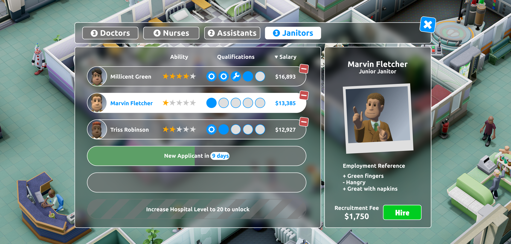
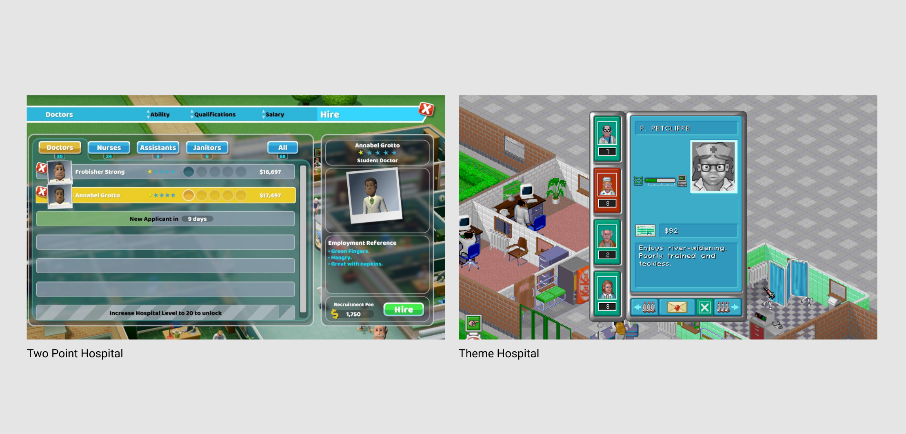
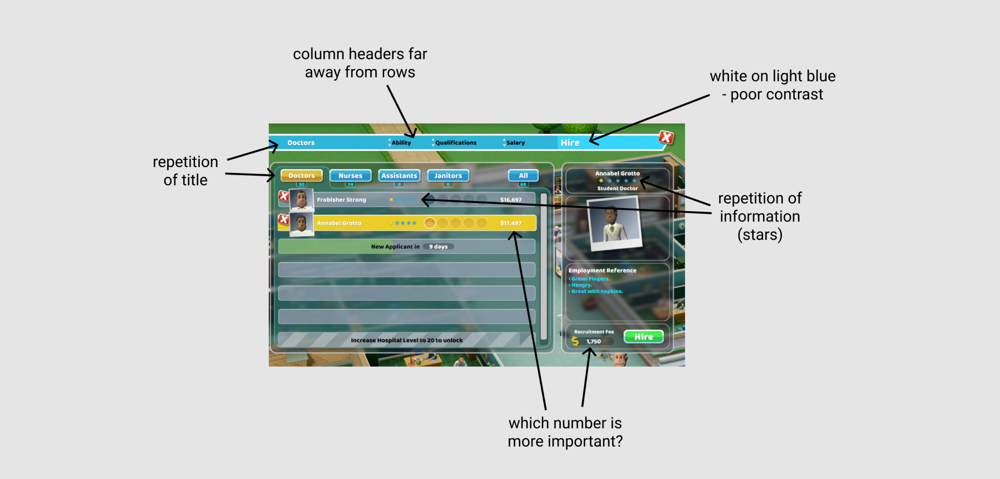
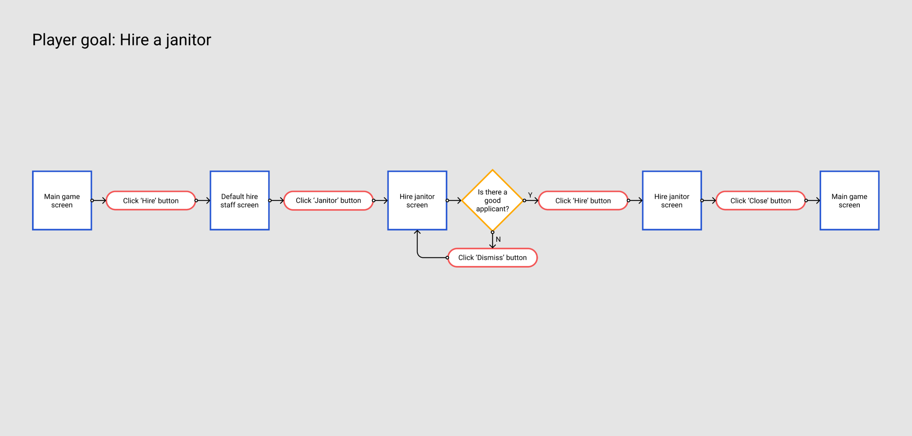
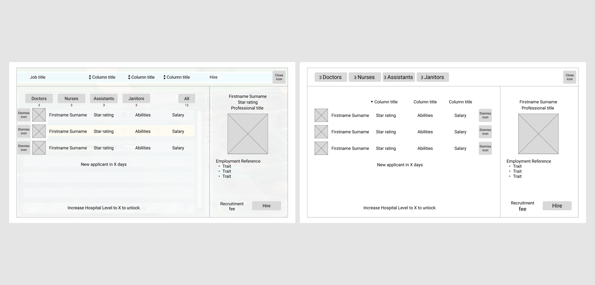
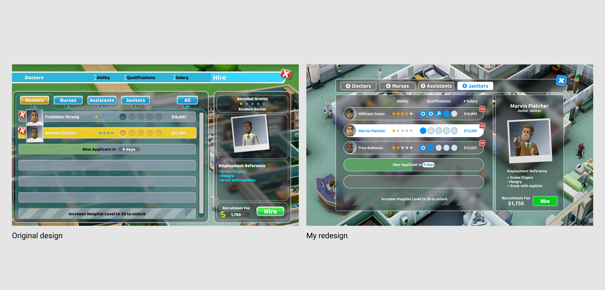

{::options parse_block_html="true" /}

# Two Point Hospital UI redesign

Having grown up with Theme Hospital as one of the few PC games I owned, I was super excited to play Two Point Hospital but found their UI to be a sticking point, not just aesthetically but also with the amount of information on the screen and the way it’s laid out. I decided to have a go at redesigning the UI for hiring staff in the game.

 

**UX design** 

I started out by recapping the player journey in an **interaction diagram**. I then traced over the original UI, turning it back into a **wireframe**. From this, I culled any repeated information and rearranged some elements. I moved the dismiss button for each potential employee to the right hand side of the list element, making them more central, to reduced the mouse travel distance between all of the buttons.

**UI design** 

My final redesign is a minimalised version of the game’s original UI, which overall takes up less screen space. I’ve used better contrasting colours and rearranged the size hierarchy of some of the text elements. Moving the dismiss buttons for each potential employee also balanced out better aesthetically with the character portraits being on the left hand side.

