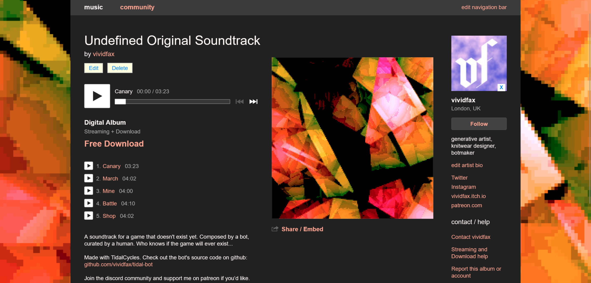
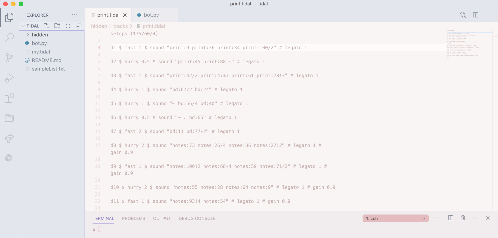

{::options parse_block_html="true" /}

# Undefined Original Soundtrack

is a soundtrack for a game that doesn't exist yet. Composed by a bot, curated by a human. Who knows if the game will ever exist...

[vividfax.bandcamp.com/album/undefined-original-soundtrack](https://vividfax.bandcamp.com/album/undefined-original-soundtrack)

 

**Generative music** 

Made with **Tidal Cycles** and **Audacity**.

