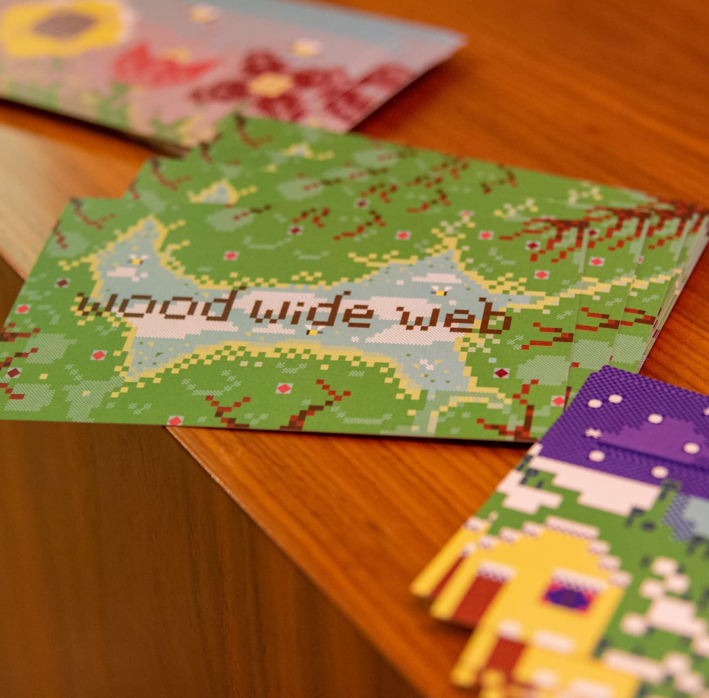
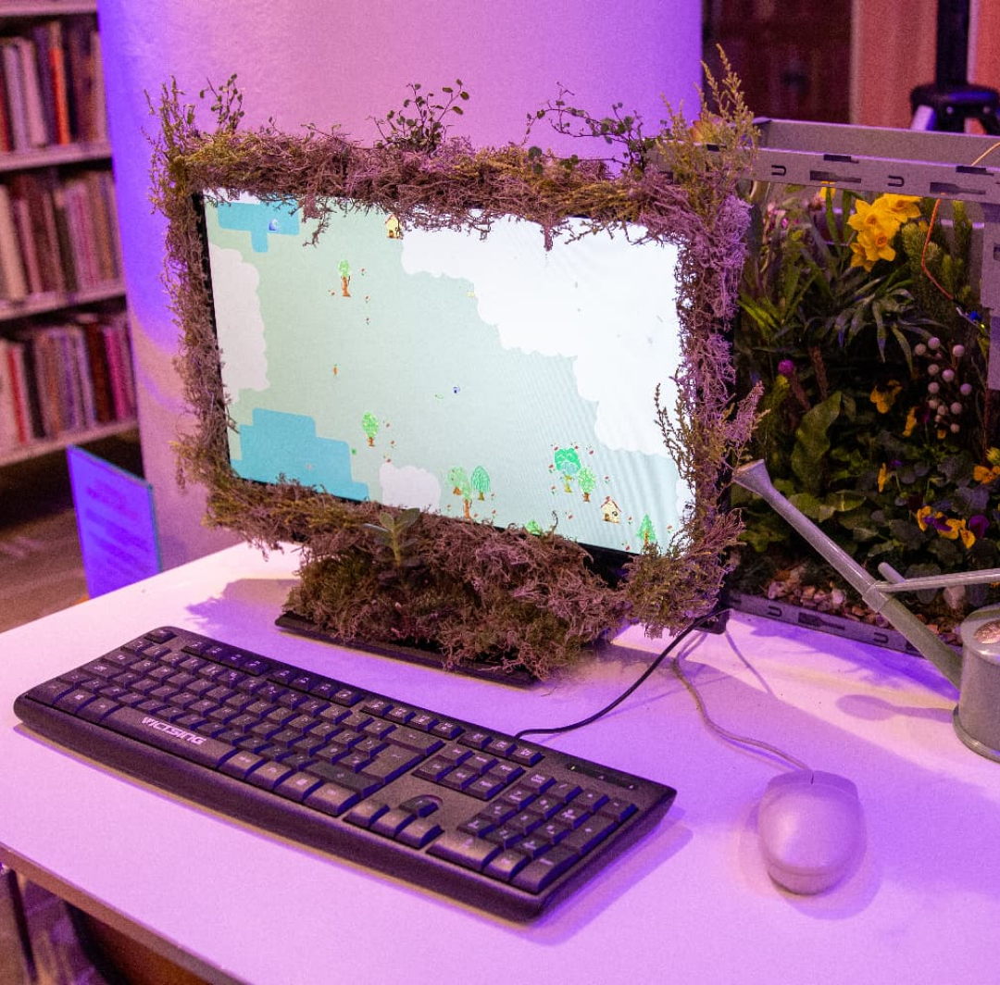
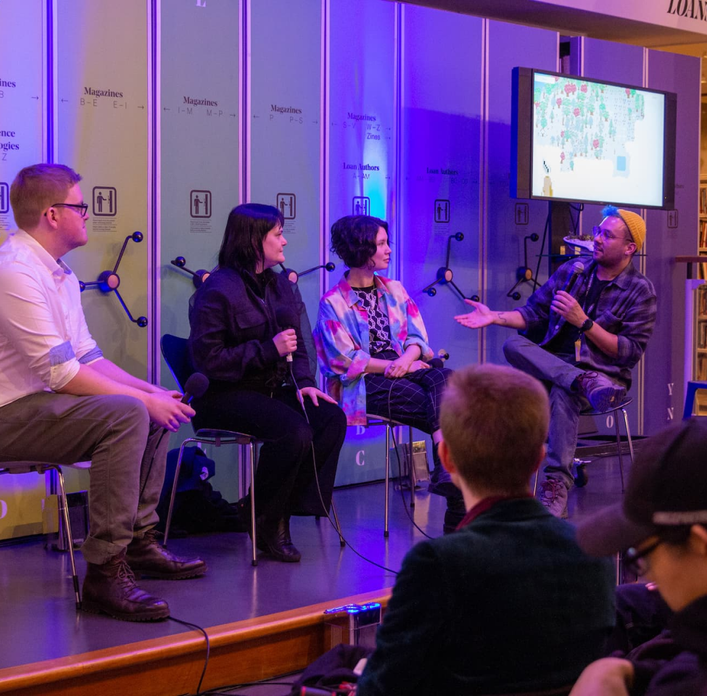
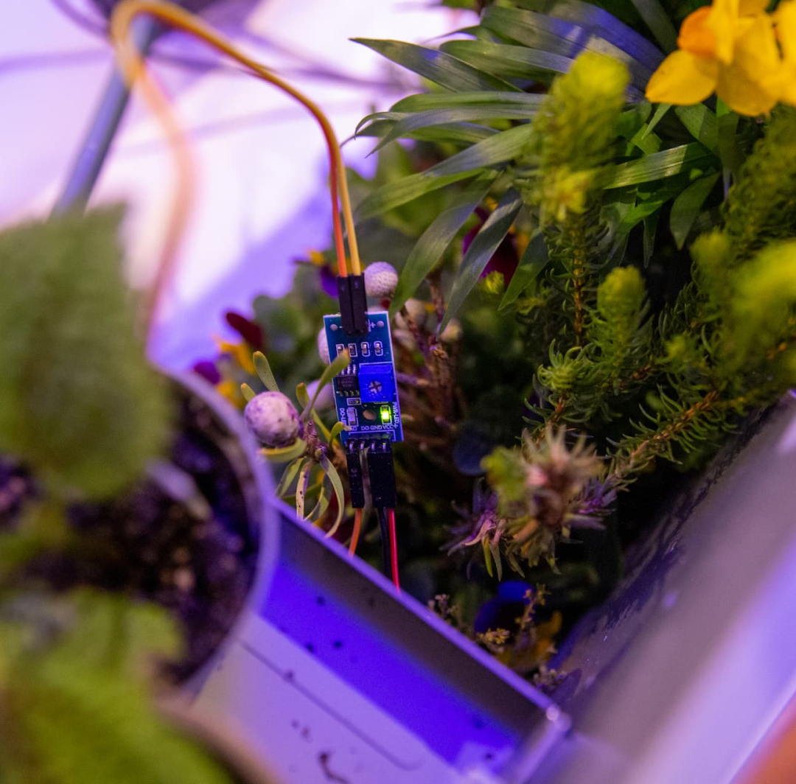

{::options parse_block_html="true" /}

# Wood Wide Web

is a **poetic walking simulator game** where words grow on trees and are carried by the wind. Stroll around your own personal landscape and plant words. The words you write may gain sentience and start to form their own ideas.

[vividfax.itch.io/wood-wide-web](https://vividfax.itch.io/wood-wide-web)

The game was made in collaboration with artist [Mariana Marangoni](https://marianamarangoni.com/), with music and sound design by [Mikey Parsons](https://www.mikeyparsons.com/). It was commissioned by [Playing Poetry](https://playingpoetry.com/) and Phoenix Cinema and Art Centre, and launched at the National Poetry Library as part of the Poetry Games exhibition.

Photography by Will Webb.

